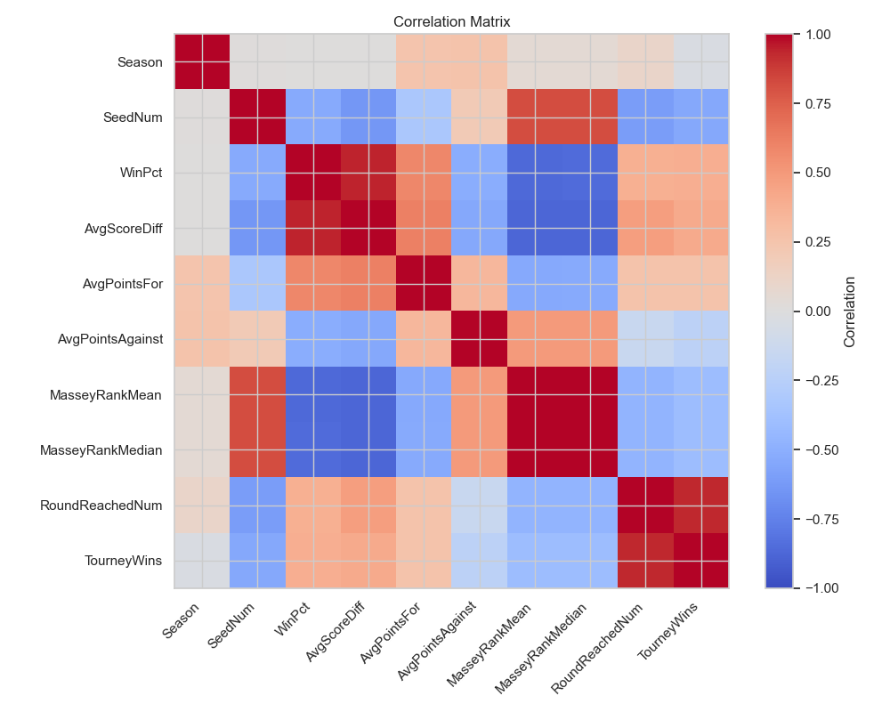

## Intro

This notebook explores whether regular-season team performance, tournament seeding, and pre-tournament ranking information can help identify NCAA men’s basketball Cinderella teams before the NCAA tournament begins. The analysis uses historical March Machine Learning Mania data and focuses on building a clean team-season dataset for exploratory analysis.

The data used in this project comes from Kaggle’s March Machine Learning Mania competition, which provides historical NCAA men’s basketball regular-season results, tournament seeds, tournament outcomes, and ranking information for predictive modeling. To respect Kaggle’s competition rules, this repository does not redistribute the raw source files and instead assumes that users download the data themselves through Kaggle before running the analysis. From an ethics standpoint, the dataset contains team- and game-level sports records rather than personally identifying information, so privacy concerns are minimal. As a result, the main legal and ethical responsibility in this project is proper use of the competition data and transparent, reproducible analysis rather than protection of sensitive personal data

## Data Loading

The raw Kaggle files are stored at the game and tournament level, so they must be transformed before analysis. The goal of preprocessing is to create one row per Season, TeamID, with regular-season features, tournament seed information, ranking features, and tournament outcomes merged into a single team-season dataset.

The preprocessing pipeline creates a team-season dataset that is more appropriate for exploratory analysis and later modeling. Regular-season statistics are built first, while tournament outcomes are created separately and merged afterward to avoid leakage from postseason results into predictor variables.

## Correlation Heatmap

Correlation analysis helps identify which regular-season and pre-tournament variables are most closely associated with tournament success. While correlation does not imply causation, it is a useful screening tool for spotting variables that may be important in later supervised models.

## Exploring Cinderella Candidates

The next plot compares regular-season strength with tournament expectation. This helps show whether lower-seeded teams that become Cinderella teams already looked stronger than their seeds suggested before the tournament started.

## Cinderella Interpretation

This scatterplot suggests that teams with stronger scoring margins generally receive better seeds, but there is still substantial spread within each seed band. The highlighted Cinderella teams tend to come from worse seed ranges while still showing respectable regular-season quality, which supports the idea that some Cinderella teams may be under-seeded rather than purely random surprises.

## Cinderella Frequency

Because the project focuses on identifying rare tournament overperformers, it is important to understand how uncommon these teams are in the full dataset. This distribution helps frame the difficulty of the prediction problem.

## Cinderella Interpretation

The distribution confirms that Cinderella team-seasons make up only a very small fraction of the dataset. This means the final prediction task will be highly imbalanced, which has important implications for later model selection and evaluation.

## Final Reflection

A major challenge in this project is defining a “Cinderella” in a way that is intuitive but also reproducible for machine learning. Different choices based on seed, tournament wins, or round reached would produce slightly different targets. The EDA suggests that seed and ranking variables explain much of tournament success, but regular-season strength measures may still help identify under-seeded teams with upset potential. The next step is to use these insights to select predictors and build supervised models while carefully avoiding leakage and addressing class imbalance.