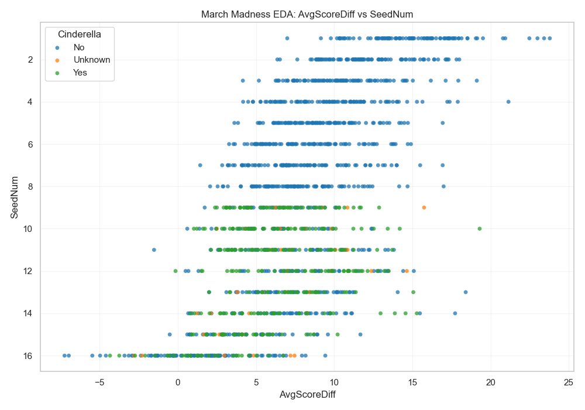

## Intro

Our md and ipnyb notebook explores whether regular-season team performance, tournament seeding, and pre-tournament ranking information can help identify NCAA men’s basketball Cinderella teams before the NCAA tournament begins. The analysis uses historical March Machine Learning Mania data and focuses on building a clean team-season dataset for exploratory analysis.

## 1. Research Question and DataSet Overview

**Research Question:** Can unsupervised anomaly detection of regular-season advanced metrics successfully identify underlying elite performance profiles in low-seeded NCAA basketball teams, and does integrating these anomaly scores improve the predictive accuracy of supervised upset classification models during the NCAA Tournament?

**Dataset Overview:** The data used in this project is sourced from [Kaggle’s March Machine Learning Mania Competition](https://www.kaggle.com/competitions/march-machine-learning-mania-2026/data), which provides historical NCAA men’s basketball regular-season results, tournament seeds, tournament outcomes, and ranking information for predictive modeling. 

**Ethical & Legal Considerations:** To respect Kaggle’s competition rules, this repository does not redistribute the raw source files and instead assumes that users download the data themselves through Kaggle before running the analysis. From an ethics standpoint, the dataset contains team- and game-level sports records rather than personally identifying information, so privacy concerns are minimal. As a result, the main legal and ethical responsibility in this project is proper use of the competition data and transparent, reproducible analysis rather than protection of sensitive personal data

## 2. Data Description and Variables

**Target Variable:**

  * `CinderellaFlag` (Binary/Categorical): The target variable for the supervised analysis. Defined as `1` if a team seeded 10 or lower wins at least two tournament games (using 2 wins as a proxy for reaching the Sweet 16), and `0` otherwise.

**Key Predictor Variables:**

  * `SeedNum`: The official numeric tournament seed (1-16) assigned by the committee.

  * `AvgScoreDiff`: The team's average regular-season point differential.

  * `WinPct`: The team's regular-season win percentage.

  * `MasseyRankMean`: The team's mean ordinal ranking from the Massey ratings system prior to the start of the tournament.

  * `AvgPointsFor` / `AvgPointsAgainst`: Average points scored and allowed per game.

**Preprocessing:**

The raw Kaggle files are stored at the game and tournament level, so they must be transformed before analysis. The goal of preprocessing is to create one row per Season, TeamID, with regular-season features, tournament seed information, ranking features, and tournament outcomes merged into a single team-season dataset.

The preprocessing pipeline creates a team-season dataset that is more appropriate for exploratory analysis and later modeling. Regular-season statistics are built first, while tournament outcomes are created separately and merged afterward to avoid leakage from postseason results into predictor variables.

## 3. Summary Statistics

*Note: The dataset contains 8,346 total team-season records (N=8,346) spanning historical seasons.*

| Variable | Count | Mean | Std. Dev | Min | Median (50%) | Max |
| :--- | :--- | :--- | :--- | :--- | :--- | :--- |
| `WinPct` | 8,346 | 0.494 | 0.186 | 0.000 | 0.500 | 1.000 |
| `AvgScoreDiff` | 8,346 | -0.212 | 6.635 | -33.222 | -0.182 | 23.788 |
| `AvgPointsFor` | 8,346 | 70.010 | 5.889 | 49.240 | 69.968 | 95.552 |
| `AvgPointsAgainst` | 8,346 | 70.222 | 5.563 | 50.429 | 70.143 | 98.207 |
| `SeedNum` | 1,540 | 8.738 | 4.671 | 1.000 | 9.000 | 16.000 |
| `MasseyRankMean` | 7,628 | 173.719 | 98.625 | 1.035 | 174.545 | 362.828 |
| `TourneyWins` | 8,346 | 0.174 | 0.670 | 0.000 | 0.000 | 6.000 |

**Categorical Frequencies (`CinderellaFlag`):**

  * `0` (Standard Team/Early Exit/Non-Tournament): 8,293 records (99.36%)
  * `1` (Cinderella Team): 53 records (0.64%)

**Insights & Relationships:**
The summary statistics reveal a massive, extreme class imbalance, with true Cinderella runs occurring in only 0.64% of the team-season records. Additionally, the count drop-off for `SeedNum` (N=1,540) confirms that only a fraction of total division-1 teams actually make the tournament. Variables like `AvgScoreDiff` have a wide variance (from -33 to +23), offering significant statistical separation that anomaly detection models can exploit.

## 4. Visualization Exploration

### Correlation Heatmap

Correlation analysis helps identify which regular-season and pre-tournament variables are most closely associated with tournament success. While correlation does not imply causation, it is a useful screening tool for spotting variables that may be important in later supervised models.

### Regular Season vs. Tournament Expectations

The next plot compares regular-season strength by using their `AvgScoreDiff` with tournament expectation `SeedNum`. This helps show whether lower-seeded teams that become Cinderella teams already looked stronger than their seeds suggested before the tournament started.

## 5. Final Reflection

A major challenge in this project is defining a “Cinderella” in a way that is intuitive but also reproducible for machine learning. Different choices based on seed, tournament wins, or round reached would produce slightly different targets. The EDA suggests that seed and ranking variables explain much of tournament success, but regular-season strength measures may still help identify under-seeded teams with upset potential. An additional major challenge is the severe class imbalance with true Cinderella teams making up only 0.64% of the dataset. The next step is to use these insights to select predictors and build supervised models while carefully avoiding leakage and addressing class imbalance (through techniques like smote or adjusting class weight).
