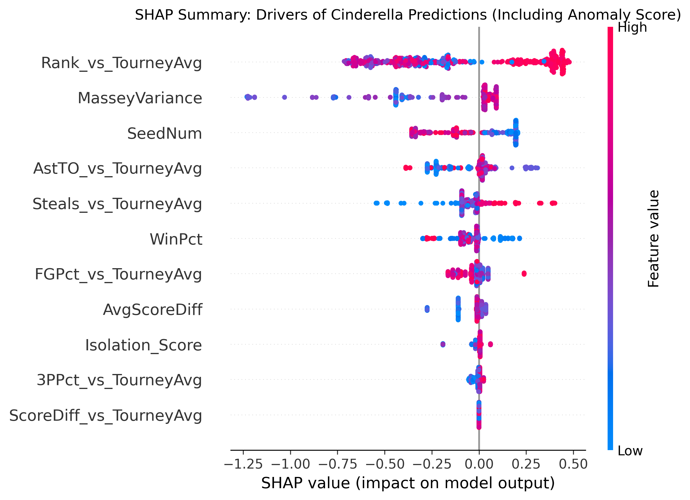

## Intro

Our md and ipnyb notebook explores whether regular-season team performance, tournament seeding, and pre-tournament ranking information can help identify NCAA men’s basketball Cinderella teams before the NCAA tournament begins. The analysis uses historical March Machine Learning Mania data and focuses on building a clean team-season dataset for exploratory analysis.

## 1. Research Question and DataSet Overview

**Project Goal:** Can supervised machine learning models identify NCAA "Cinderella" teams by analyzing regular-season anomaly scores and "Expectation Gaps" among low-seeded tournament candidates?

By restricting our dataset strictly to Cinderella candidates (Seeds 10-16) and engineered features comparing them to tournament averages, this phase attempts to detect the statistical DNA of extreme underdogs that win 2+ tournament games.

## 2. Supervised Modeling Choices

To strictly prevent data leakage, our unsupervised Isolation_Score was fit exclusively on the training set, and standard scaling was applied inside our cross-validation pipelines. Because true Cinderellas only make up 7.79% of our candidate pool (53 out of 680), standard accuracy was discarded in favor of Precision-Recall AUC (PR-AUC) and F1-Score.

| **Model Type** | **Key Hyperparameters Explored** | **Validation Setup** | **PR-AUC** |
| ------------------ | ------------------ | ------------------ | ------------------ |
| **Random Forest (Baseline) | `max_depth`: [5, 10]   `n_estimators`: 100   `class_weight`: 'balanced' | Stratified 5-Fold CV | 0.1334 |
| **XGBoost Classifier | `max_depth`: [2, 3]   `learning_rate`: [0.01, 0.05]   `colsample_bytree`: [0.5, 0.7]   `gamma`: [0.1, 0.5, 1.0] | Stratified 5-Fold CV | 0.1681 |

*Note: Further threshold tuning on the XGBoost model (shifting the probability threshold to 0.6943) yielded a final F1-score of 0.2953 on the training set.*

## 3. Model Comparison Selection

Insights & Trends: The XGBoost model vastly outperformed the Random Forest baseline across all meaningful metrics, particularly in Recall (0.6861 vs. 0.3056). While Random Forest struggled to isolate true positives despite balanced class weights, XGBoost successfully identified over two-thirds of historical Cinderellas.

Best Model: XGBoost Classifier. Tree-based boosting naturally handles complex, non-linear interactions (e.g., combining a poor SeedNum with a high Rank_vs_TourneyAvg).

Challenges Faced: The "Small Data" trap. By filtering our dataset down to only Cinderella candidates, our sample size shrank to just 680 rows. Early XGBoost iterations overfit this small dataset heavily. We overcame this by introducing aggressive regularization: severely limiting tree depth (max_depth=2), pruning useless branches (gamma=0.1), and randomly dropping features during tree construction (colsample_bytree=0.7) to break the dominance of the SeedNum variable.

## 4. Explainability and Interpretability

**Intepretation:** Both our SHAP summary plot and XGBoost Feature Importance outputs reveal that while SeedNum remains highly predictive, Expectation Gap metrics successfully drove the model's logic. The second most important feature was Rank_vs_TourneyAvg, meaning the model aggressively looked for teams whose Massey Ratings were much closer to elite tournament averages than their low seeds implied. Furthermore, AstTO_vs_TourneyAvg (Ball Security) and MasseyVariance scored highly, proving the model learned that extreme statistical variance and playmaking efficiency are required to pull off massive upsets.

## 5. Final Takeaways

Supervised machine learning struggles to successfully identify under-seeded tournament threats although it does better than random guessing. Our reframed approach—comparing underdog candidates directly against elite tournament averages—proved effective. This analysis confirms our research question: a Cinderella run is rarely a statistical accident; these teams possess distinct efficiency profiles (strong ball security, high rank variance, and powerhouse-level margins) that separate them from standard low-seeded teams before the tournament even begins.