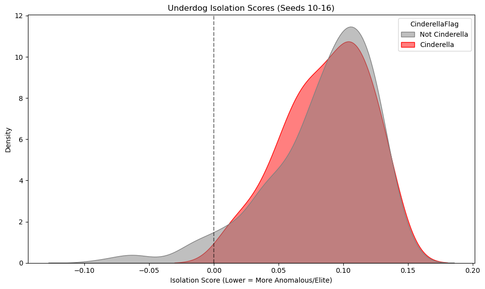
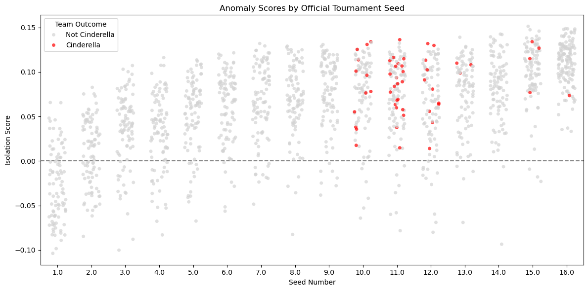
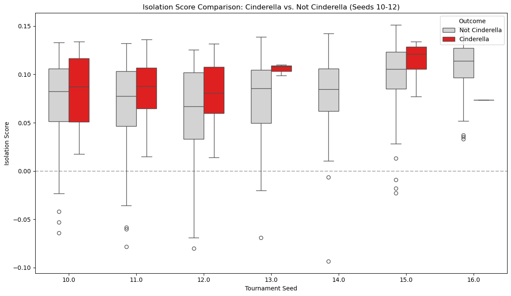
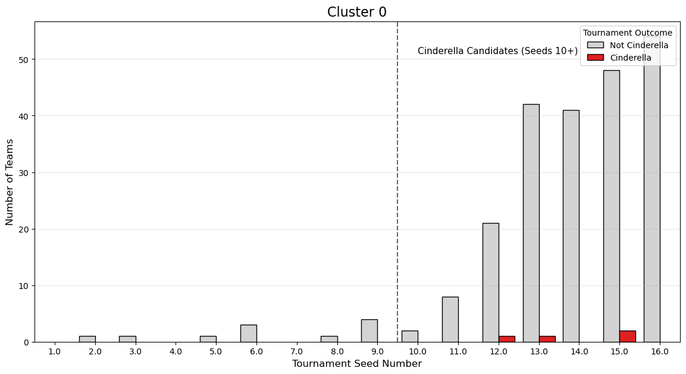
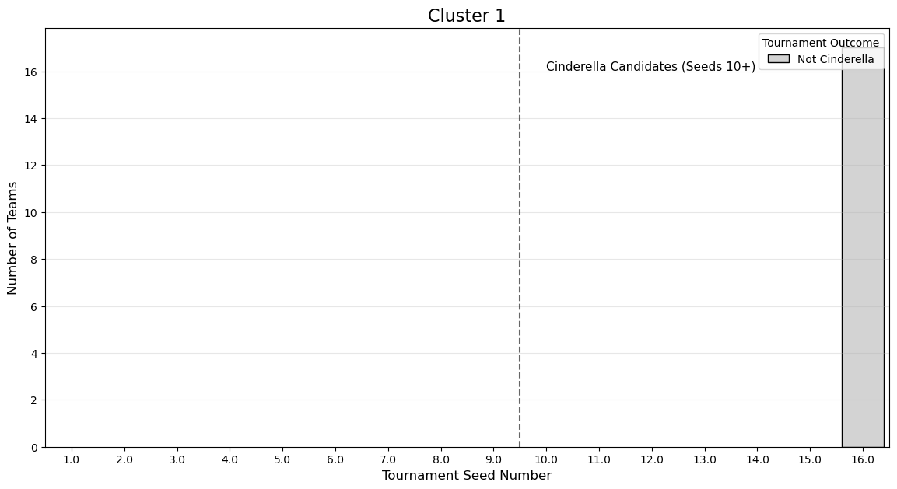
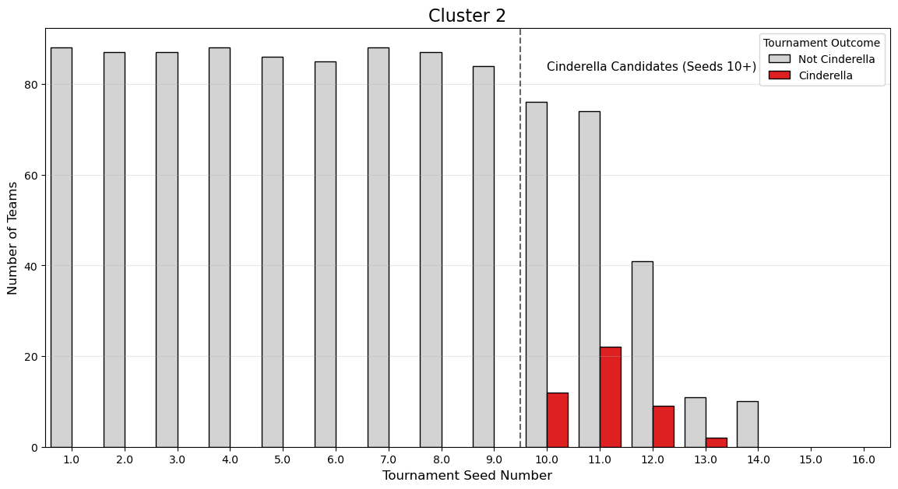
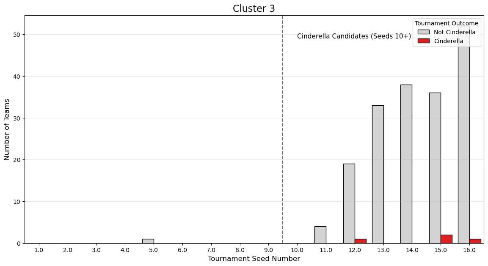

## Intro

Our md and ipnyb notebook explores whether regular-season team performance, tournament seeding, and pre-tournament ranking information can help identify NCAA men’s basketball Cinderella teams before the NCAA tournament begins. The analysis uses historical March Machine Learning Mania data and focuses on building a clean team-season dataset for exploratory analysis.

## 1 Research Question and Dataset Overview

**Project Goal:** Can supervised machine learning models identify NCAA "Cinderella" teams by analyzing regular-season anomaly scores and "Expectation Gaps" among low-seeded tournament candidates?

By restricting our dataset strictly to Cinderella candidates (Seeds 10-16) and engineered features comparing them to tournament averages, this phase attempts to detect the statistical DNA of extreme underdogs that win 2+ tournament games.

## 2 Unsupervised Modeling Choices

Our unsupervised phase focuses on identifying "statistical DNA" using **Isolation Forests** to calculate an **Isolation Score**. This score measures how much a team’s regular-season performance deviates from the "average" Division I profile.

  **Feature Selection:** The model was trained on 8 core metrics: `AvgScoreDiff`, `WinPct`, `AvgPointsFor`, `AvgPointsAgainst`, `MasseyRankMean`, `AstTO_Ratio`, and `AvgRebounds`.
  **The Isolation Score:** A **lower (more negative)** score indicates a highly distinct or anomalous team (like a 1-seed powerhouse or a winless team), while a **higher (closer to 0.0)** score indicates a mathematically "normal" or consistent team.
  **The Hypothesis:** We initially assumed Cinderellas would be "elite anomalies" with low scores similar to top seeds. However, the results showed that Cinderellas are actually statistically "normal" and lack the erratic variance seen in other low-seeded teams.

## 3 Model Comparison Selection

While the Isolation Forest provided a gradient of "oddity" we utilized **Gaussian Mixture Models (GMM)** as a categorical enhancement to group teams into distinct archetypes.

  **Isolation Forest Results:** Successfully identified extreme outliers but showed that Cinderellas are largely indistinguishable from their peers based on broad anomaly scores alone.
  **GMM Clustering:** Attempted to group teams into profiles such as "Elite Powerhouses," "Erratic Underdogs," and "Stable Underdogs".
  **Selection Logic:** Based upon the GAussian Mixture model, we found that by dividing teams into 4 distinct clusters, cinderella teams were properly identified to have traits similar to higher seeded teams. This made it effective in selection where Isolation struggled.

## 4 Explainability and Interpretability

### Underdog Isolation Scores (KDE)

  **Interpretation:** The plot shows that Cinderella teams are largely indistinguishable from non-Cinderella teams. They consistently fall within the same distribution and do not appear mathematically different from standard early-exit teams based on these unsupervised features.

### Anomaly Scores by Seed (Strip Plot)

  **Interpretation:** While 1 and 2-seeds stand out as clear anomalies (low scores), Cinderellas (red dots) do not stand out significantly compared to other members of their seed line. We assumed Cinderellas would need negative-leaning scores to pull off upsets, but they instead possess scores across the standard distribution of their seed.

### Comparison Within Seed

  **Interpretation:** Even comparing after stratifying by seeds, you can see that there isn't a clear pattern for Cinderella type teams based upon Isolation score.

### GMM Cluster 2

  **Interpretation:** The Gaussian Mixture Model was effectively able to show that most Cinderella's belonged to a certain archetype. Or rather, they often had stats similar to higher seeded teams. Which implied they were lower seeded than their stats would typically suggest.

## 5 Final Takeaways

The unsupervised phase showed that from a strict outlier perspective, a Cinderella run remains difficult to predict. According to our Isolation forest, these teams are characterized by their statistical "normalcy" and lack of erratic variance.

However while the Isolation Forest found it difficult to separate Cinderella Teams, our Gausian Mixture Model was able to properly identify about 82% of historical Cinderella teams based upon their stat profiles.
